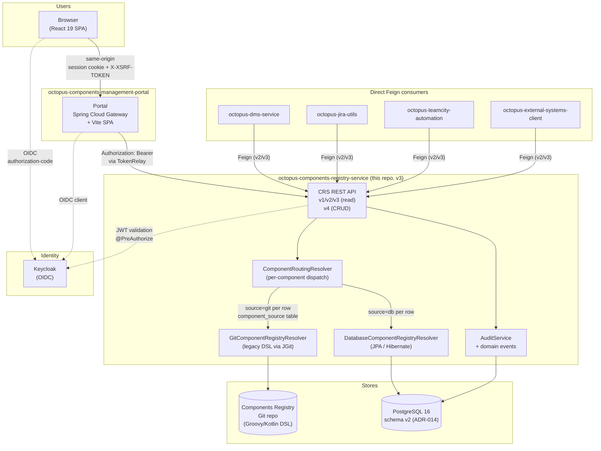

# High-level architecture

System view of CRS v3 and the consumers around it. Detailed implementation pointers are in [`technical-design.md`](../technical-design.md) and the boundary contract is in [ADR-012](../adr/012-portal-architecture.md).

## Request flow

## What the diagram pins

- **Browser path goes through the Portal only.** The Portal is a BFF — it holds the OAuth2 session, the browser never sees the JWT, and Spring Cloud Gateway's `TokenRelay` stamps the bearer token on calls to CRS. CSRF is plain double-submit. Canonical decision: [ADR-012](../adr/012-portal-architecture.md).
- **Direct Feign consumers bypass the Portal.** DMS, Jira utils, TeamCity automation, and the external-systems client talk to CRS directly with their own client credentials. The Portal is on the browser path only.
- **CRS is a single OAuth2 resource server** for both paths. It cannot tell whether a request originated in a browser session relayed by the Portal or in a Feign call from a service — it validates the JWT and applies `@PreAuthorize` the same way. Auth contract: [ADR-004](../adr/004-auth-keycloak.md).
- **Per-component routing replaces the global mode flag.** Every read goes through `ComponentRoutingResolver`, which consults the `component_source` table (single source of truth) and dispatches to either the legacy Git resolver or the DB resolver. No `registry.storage=git|db|routing|dual` flag exists. Decision: [ADR-007](../adr/007-dual-read-migration.md). Why no per-JVM cache on `component_source`: [ADR-007 §"Subsequently rejected refinement"](../adr/007-dual-read-migration.md).
- **Audit is a first-class persisted concern.** `AuditService` writes to an `audit_log` table; v4 controllers emit domain events that the audit listener consumes. Decision: [ADR-005](../adr/005-audit-log.md).
- **Storage targets are distinct.** The Git DSL repo is a separate VCS source (typically a Bitbucket clone); PostgreSQL holds the v2 schema specified in [schema-spec.md](../schema-spec.md). They are not synchronised continuously — migration is a one-way per-component cutover per [ADR-013](../adr/013-cutover-strategy.md) (Proposed).
