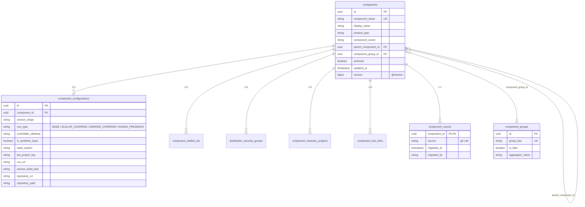
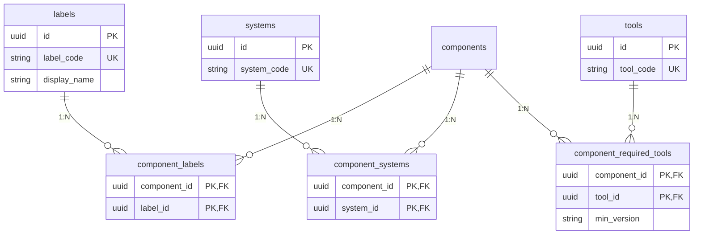
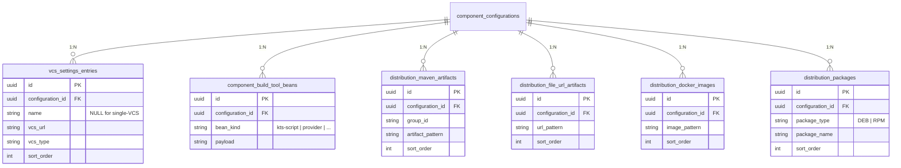

# Database schema — ERD (schema v2 / Model A')

Entity-relationship diagram of the v2 schema baseline (`V1__schema.sql`). The full column-by-column specification lives in [schema-spec.md](../schema-spec.md); the design rationale is in [ADR-014](../adr/014-schema-v2.md).

23 tables across 7 groups. The diagram is split into views to stay readable.

## Core + per-version configurations

The `components` table holds one row per component (canonical identity). All per-version data lives on `component_configurations` — base row + sparse single-attribute overrides + marker rows for child-collection replacement.

## Dictionaries + M:N junctions

Reference data is admin-managed (or auto-discovered during migration). Components reference dictionaries through pure M:N junction tables.

## Configuration children + distribution family split

Per-configuration relationships fan out to typed family tables. The distribution split is the key reason ADR-014 chose Model A' over Model A (single wide row): we keep type safety while modelling four distinct distribution families.

## Cross-cutting infrastructure tables

Audit and operational state — not part of the component model proper.

| Table | Purpose |
|---|---|
| `audit_log` | Append-only audit trail for v4 CRUD operations. JSON before/after via Hibernate `@JdbcTypeCode(SqlTypes.JSON)`. Source for `/audit/**` endpoints. Decision: [ADR-005](../adr/005-audit-log.md). |
| `registry_config` | Singleton-shaped key/value table for runtime configuration (e.g. field-visibility overrides). |
| `dependency_mappings` | Component → component dependency mapping registry (SYS-037). |
| `git_history_import_state` | Per-component cursor for the `/migrate-history` backfill job (MIG-026). |

## Resolve algorithm in one line

For `(componentName, version)`: load `BASE` row + all `SCALAR_OVERRIDE` and `MARKER_OVERRIDE` rows whose `version_range` contains `version`; merge per attribute, with `OVERRIDE` rows winning over `BASE`. Synthetic-base rows (`is_synthetic_base = true`) are skipped on legacy enumeration endpoints to eliminate the MIG-029 spurious-row issue at source. Full algorithm + edge cases: [schema-spec.md §"Resolve algorithm"](../schema-spec.md).
